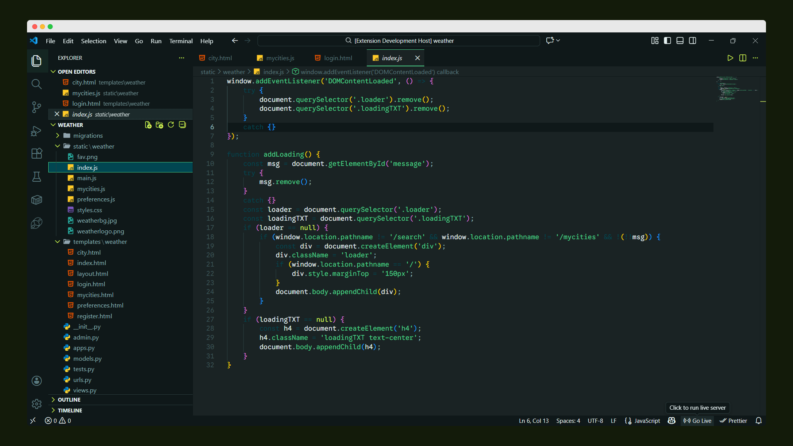

<<<<<<< HEAD
# Melody Noir
Melody Noir is a calm, cinematic dark theme.
=======
# Melody Noir Theme

Melody Noir is a calm, cinematic dark theme inspired by the mood and melody of a Patrick Watson song, crafted for distraction-free coding.



### Features

- Soft, desaturated syntax colors
- High contrast with low visual noise
- Carefully tuned UI & terminal colors
- Designed for long coding sessions

## Installation

1. Open **Extensions** sidebar in VS Code
2. Search for `Malachite Starship`
3. Click **Install**
4. Press `Ctrl+Shift+P` (or `Cmd+Shift+P` on Mac)
5. Type `Preferences: Color Theme` and select **Malachite Starship**

## Manual Installation

1. Download the latest `.vsix` file from [Releases](https://github.com/niloymajumder/melody-noir/releases)
2. In VS Code, go to **Extensions** → **...** → **Install from VSIX**
3. Select the downloaded file

## Color Palette

| Color           | Hex       | Usage                              |
| --------------- | --------- | ---------------------------------- |
| Primary Green   | `#4BD289` | Functions, strings, active elements|
| Secondary Green | `#2DD17E` | Highlight, success states          |
| Lime Accent     | `#D6F65C` | Numbers, constants, warnings       |
| Teal            | `#016E7F` | Types, classes, UI accents         |
| Dark Teal       | `#014651` | Keywords, storage                  |
| Background      | `#1A2324` | Main editor background             |
| Sidebar         | `#0F1819` | Side panels                        |
| Text            | `#E6F2F2` | Primary text                       |
| Muted Text      | `#8AB3B6` | Secondary text                     |
| Comments        | `#5A7A7F` | Comments, disabled text            |
| Error           | `#FF8C8C` | Errors, deletions                  |
| Warning         | `#D6F65C` | Warnings                           |

## Screenshots

(not)

## Customization

If you want to customize the theme:

1. Install the theme
2. Press `Ctrl+Shift+P` (or `Cmd+Shift+P` on Mac)
3. Type `Preferences: Open Settings (JSON)`
4. Add your customizations:

```json
{
  "workbench.colorCustomizations": {
    "[Malachite Starship]": {
      "activityBar.background": "#your-color",
      "editor.background": "#your-color"
    }
  }
}

---
Inspired by mood, not trends.
>>>>>>> 6c7d7b5 (Initial release: Melody Noir v1.0.0)
