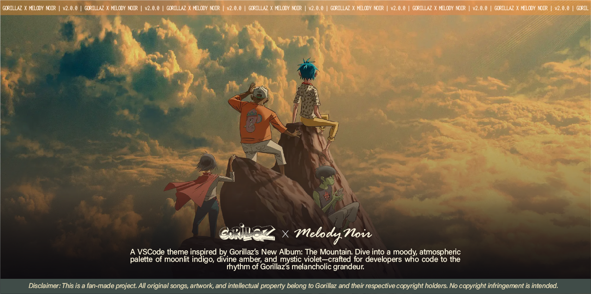
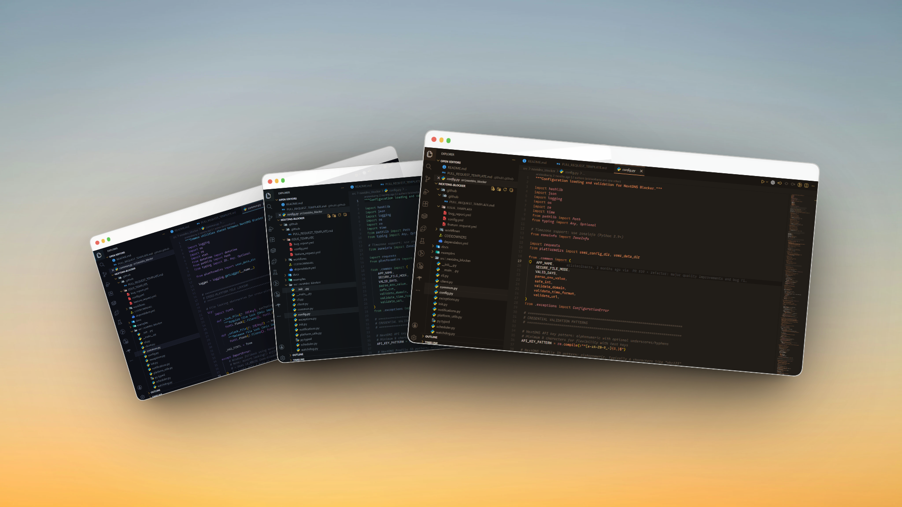
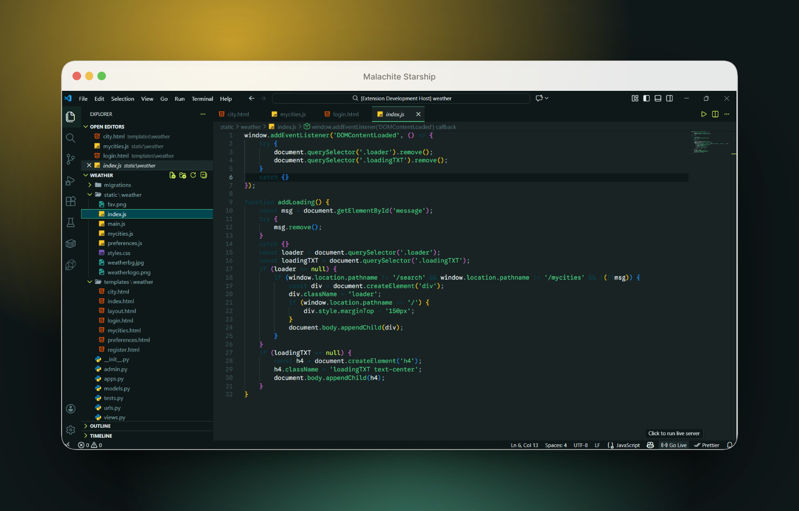
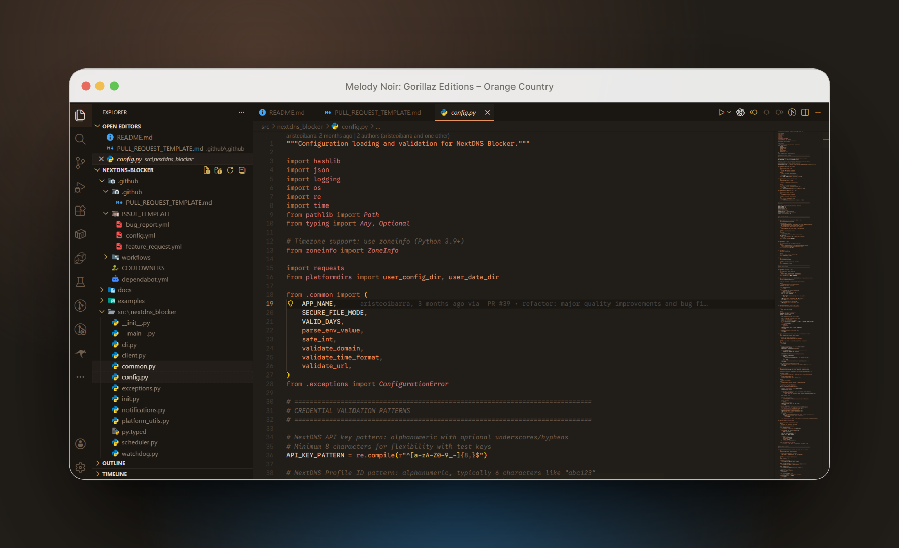
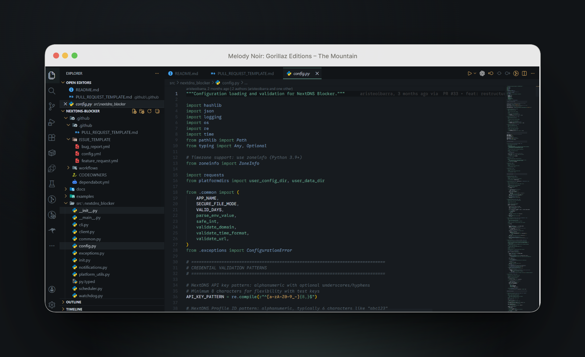
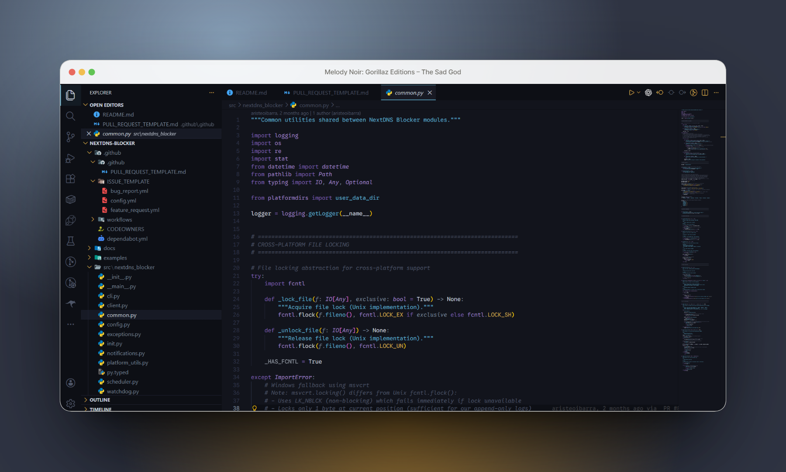
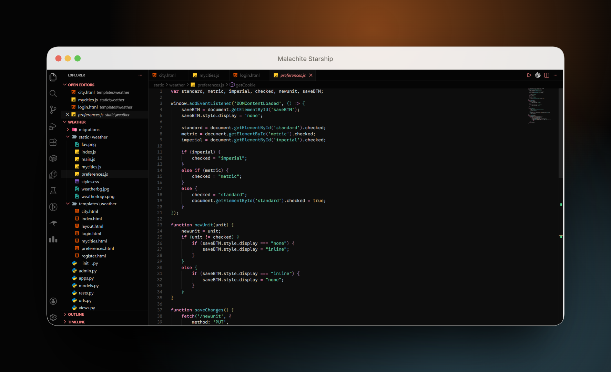
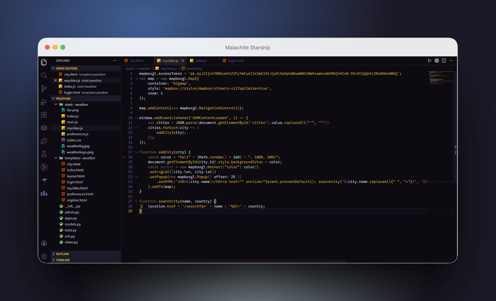
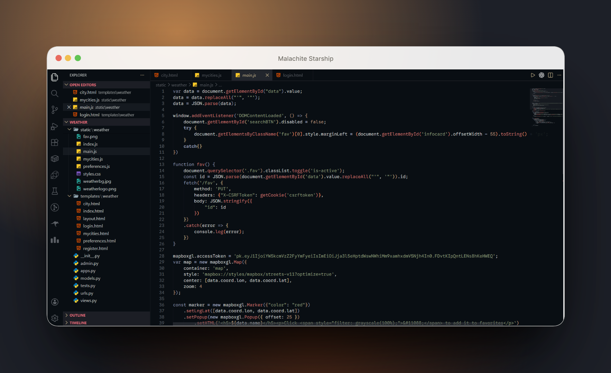

<div align="center">



# Melody Noir

*A collective of VS Code themes inspired by music.* <br>
Melody Noir transforms songs into **color palettes for code** — calm, cinematic, and distraction-free environments designed for long creative sessions.

<span>
  <a href="https://marketplace.visualstudio.com/items?itemName=bluefloyd.melody-noir"></a>
  <a href="https://github.com/niloymajumder/melody-noir"></a>
  <a href="./LICENSE"></a>
</span>

</div>

---

## In a Nutshell
>
> A handcrafted collection of VS Code themes

- **Song-Inspired Themes**: Each theme is born from a song’s mood, rhythm, and atmosphere.
- **Low-Noise Design**: Soft, desaturated syntax colors with high contrast and minimal visual clutter.
- **Full Integration**: Themes extend to UI, terminal, and Git for a seamless experience.
- **Built for Focus**: Designed for long coding sessions, reducing eye strain and distractions.

---

## Previews



| Melody Noir | Orange County | The Mountain | The Sad God |
|:-----------:|:-------------:|:------------:|:-----------:|
|  |  |  |  |

| Delirium | The God of Lying | Casablanca | The Manifesto |
|:--------:|:----------------:|:----------:|:-------------:|
|  |  |  |  |

---

## Themes

### Malachite Starship

> v1.0.0

Inspired by [*Melody Noir — Patrick Watson*](https://open.spotify.com/track/1e1a7eAlICks9mch3UVsEH?si=8d835943658c45da)

A calm palette of melancholy greens and soft teals designed for distraction-free environments.

---

### Gorillaz Editions

Inspired by [*The Mountain (2026) — Gorillaz.*](https://open.spotify.com/album/1RvJmGd47lKS4XMXs9j8hD?si=4ljykkyKRIWxTvMcyhs0TQ)
> v2.0.0–v2.1.0

These themes interpret songs from the album as coding environments — from warm sunset tones to psychedelic neons.

**Orange County** — Warm, nostalgic amber and sienna tones evoking summer dusk.

**The Mountain** — Misty dawn palette with slate blues and soft greens, contemplative and serene.

**The Sad God** — Bioluminescent atmosphere: deep void-blacks with cyan and warm gold, mystical and introspective.

**Delirium** *(v2.1.0)* — Psychedelic chaos: hot pink, neon cyan, electric gold, and radiation green — vibrant and disorienting.

**The God of Lying** *(v2.1.0)* — False divinity: god-gold hierarchies, jade truths, and skeptical purples — satire and subversion.

**Casablanca** *(v2.1.0)* — Noir-dystopia: dame gold, sky blues, and sienna romance — mystery and tension.

**The Manifesto** *(v2.1.0)* — Revolution palette: blood red, revolution orange, and militant blacks — urgency and defiance.

---

## Install

1. Open **Extensions** on VS Code (`Ctrl + Shift + X`).
2. Search for [**Melody Noir**](https://marketplace.visualstudio.com/items?itemName=bluefloyd.melody-noir)
3. Install and select via `Preferences → Color Theme`.

---

## Customization

Theme colors can be overridden in `settings.json`.

```json
{
  "workbench.colorCustomizations": {
    "[Melody Noir: Gorillaz Editions — The Sad God]": {
      "editor.background": "#your-color"
    }
  }
}
```

---

## Bug Reporting & Contributions

If you notice any visual issues, bugs, or have suggestions for improvement:

- **Report a bug**: Open an [issue on GitHub](https://github.com/niloymajumder/melody-noir/issues)
- **Contribute a fix**: Submit a pull request with your proposed changes

Your feedback is essential for improving the themes!

---

## License

MIT License ©2026 | Niloy Majumder
